# PI-Pizzaria
Diagrama de Caso de Uso

MER

Prototipo:

Tela do Carrinho
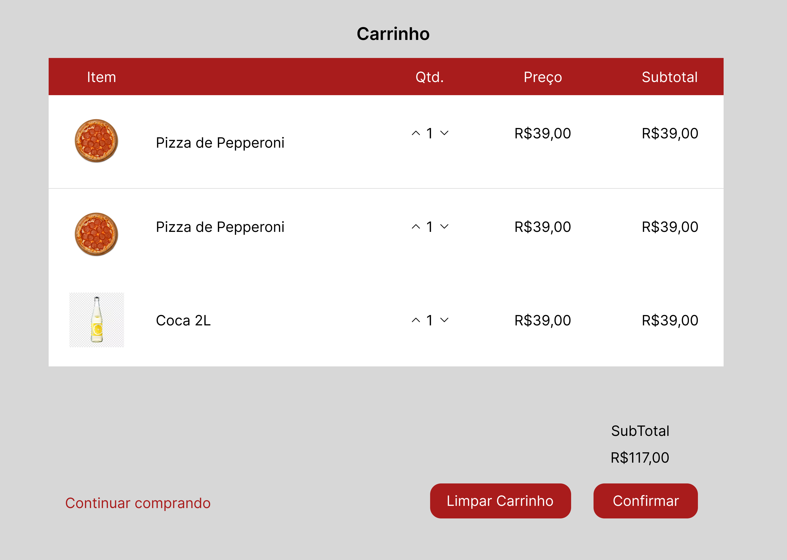

Tela de Confirmação de Compra
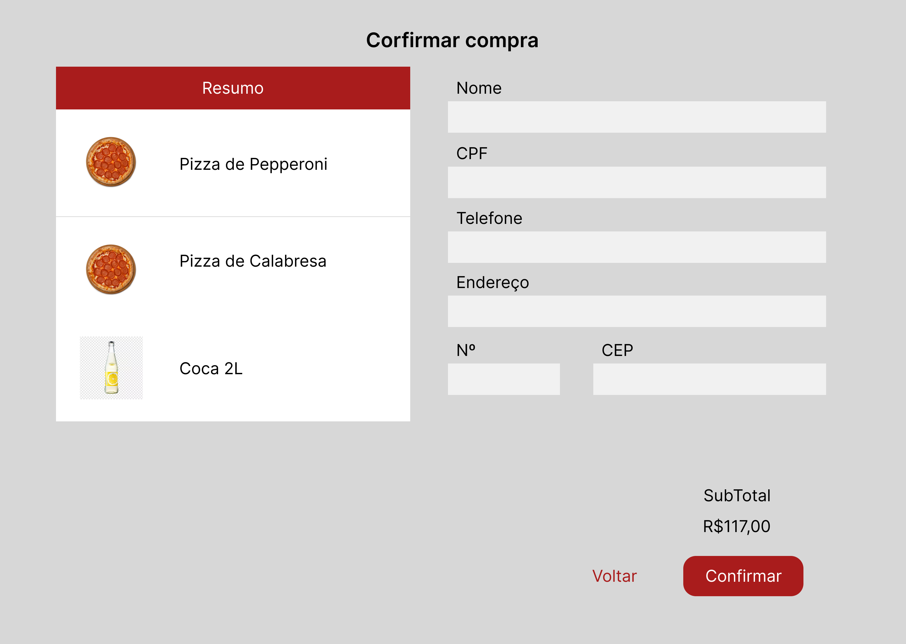

Tela de Pagamento

Tela de Login do Administrador
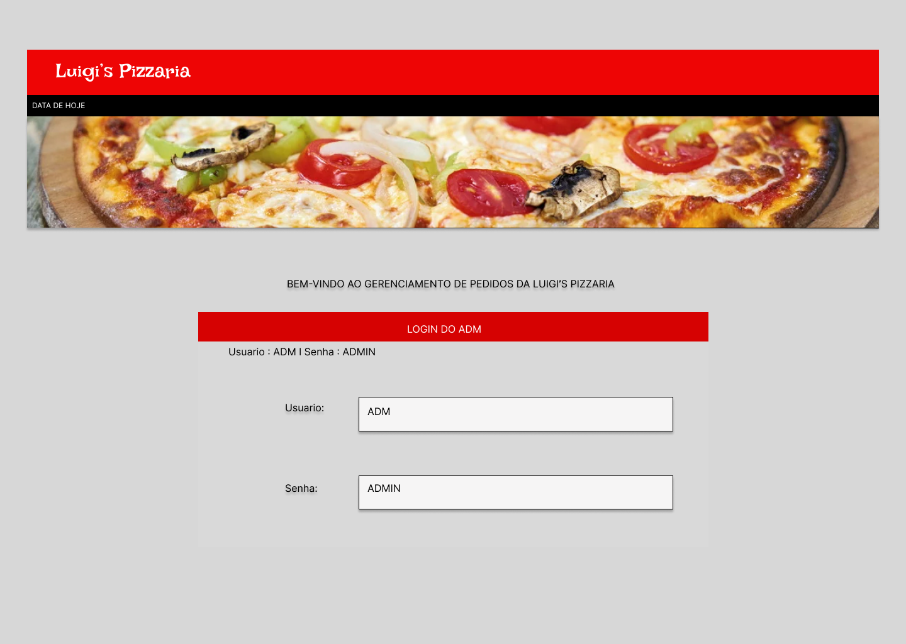

Tela de Menu do Administrador
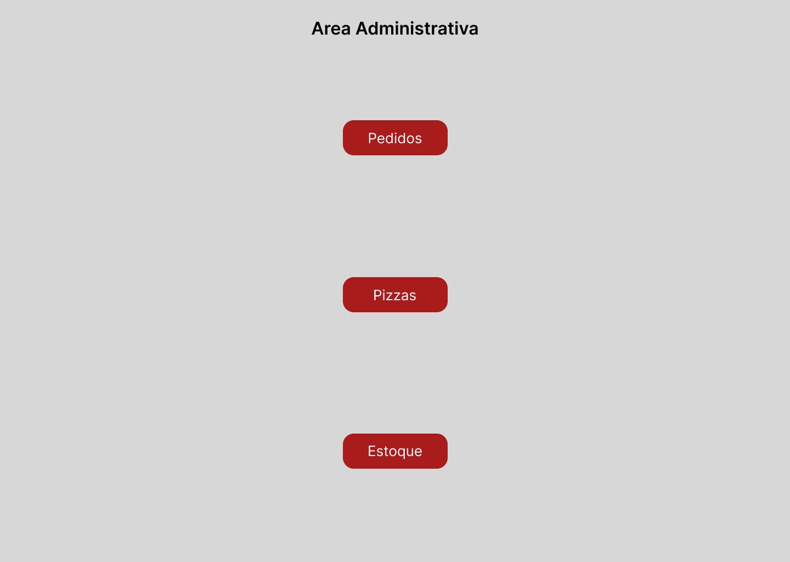

Tela de Gerenciamento do Pedido
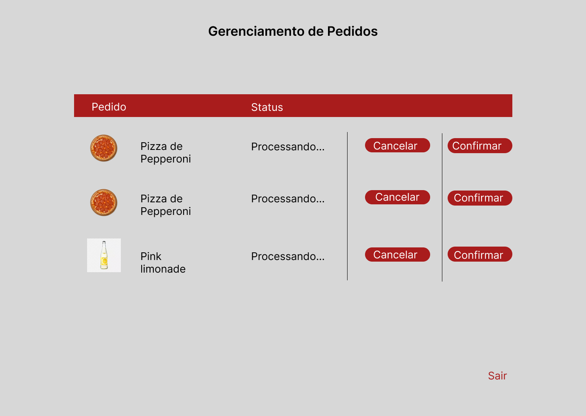

Tela de Estoque
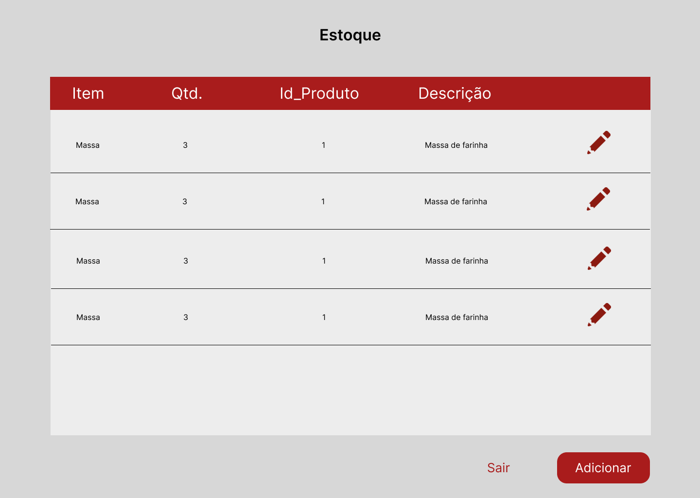

Tela de Editar Ingrediente
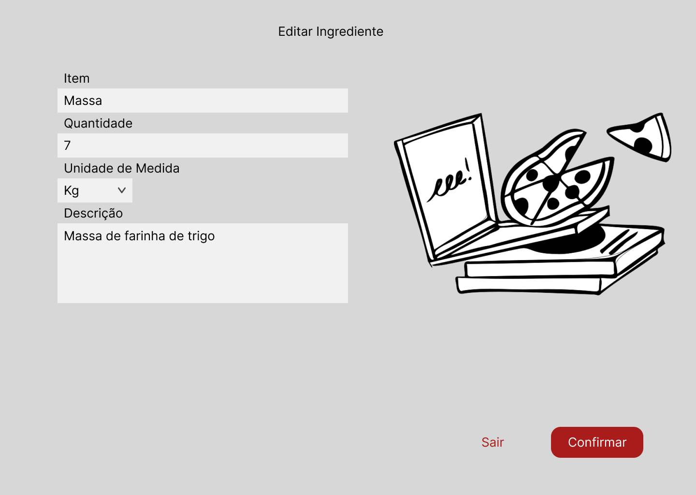

Tela de Adicionar Ingrediente
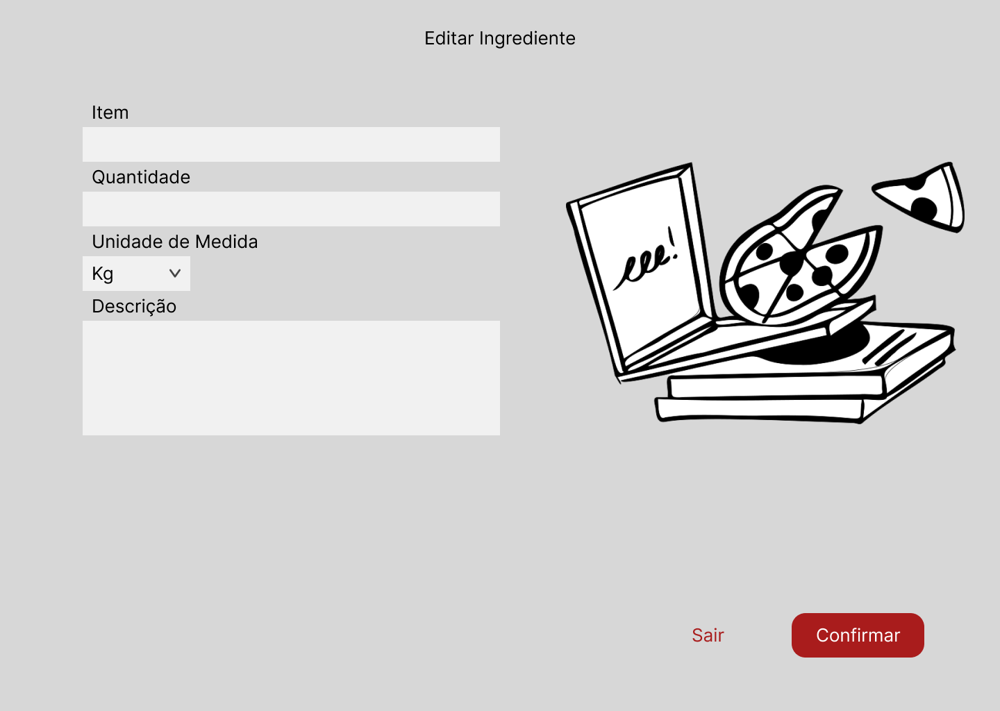

Tela de Gerenciar Cardapio
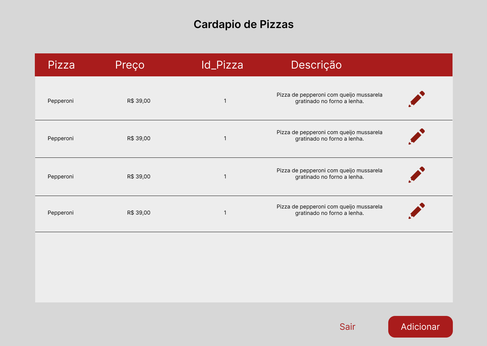

Tela de Editar Pizza
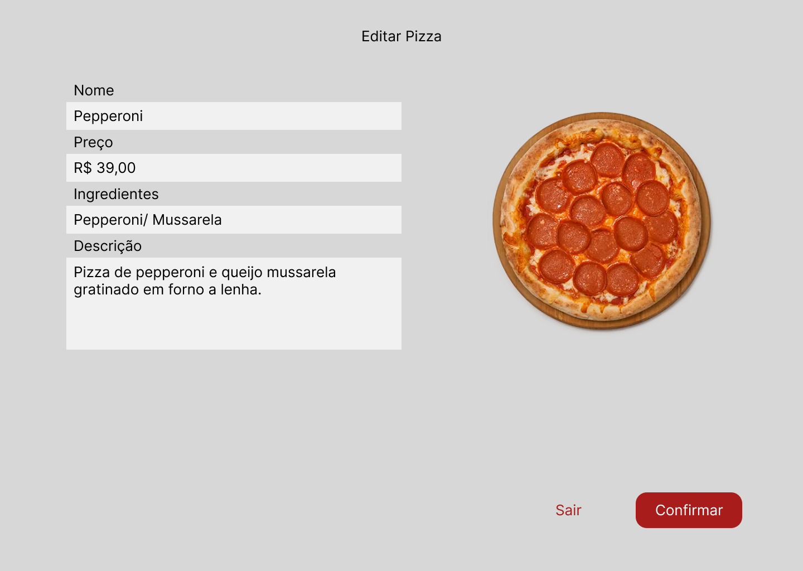

Tela de Adicionar Pizza
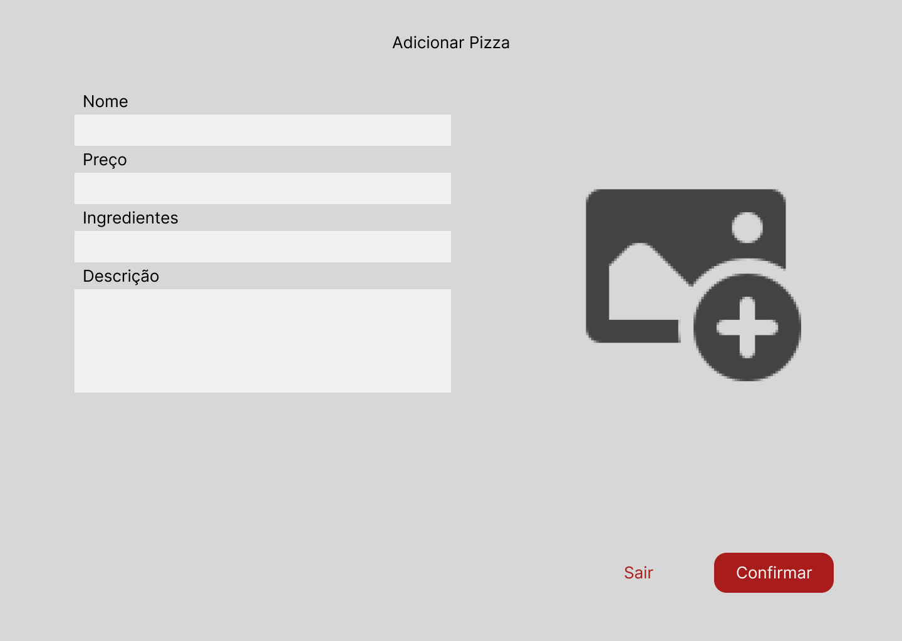
